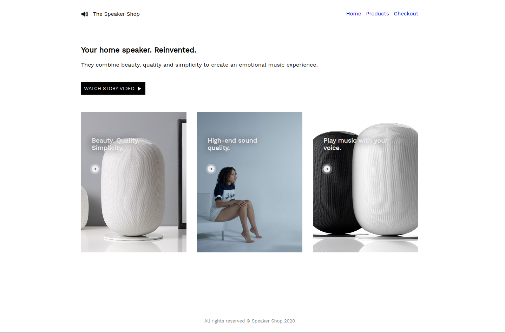

# Homepage of a speaker shop.

Recreate the speaker-shop website, this time utilising sass and mixins. Make use of the boilerplate code in the index.html and the assets in the images folder.

## Tasks

1. Create a file `styles.scss`.
2. Initialize a package.json file with `npm init` and install sass as a dev dependency.
3. Create the following script :- "compile": "sass styles.scss styles.css --no-source-map --watch".
4. Run the script with the command "npm run compile".
5. Starts coding! Create the website as shown in the mockup.

### Design mock-up

Font: _Work Sans_ from **Google Fonts**
